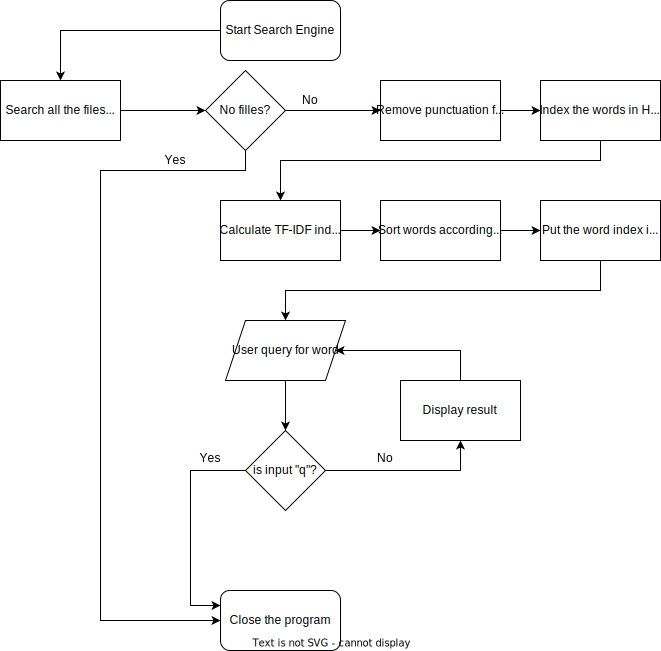

# Project

This is a simple search engine program which returns the documents in which the searched word is found in an inverted index. The index is sorted by TF-IDF. 

The search engine first finds all the documents in a given directory with a ".txt" extension. It then removes every punctuation and extracts each word from each document to store them in a HashMap. After that it calculates each word's TF-IDF index and sorts them accordingly. Finally, the user can input the word he/she wishes to search in the documents and a result is returned.

## Description of Classes
There are two classes in the program: SearchEngine class and Documents class. The SearchEngine class contains the main method and is the class which performs the storage and sorting of index. The Documents class returns all the files and words contained in a given directory. The SearchEngine calls the Documents class to get the files.

A relative path is used for the files in a given directory. If the program is needed to be run from the cmd, and absolute path should be provided in the code.

The flowchart of the program is as follows:

